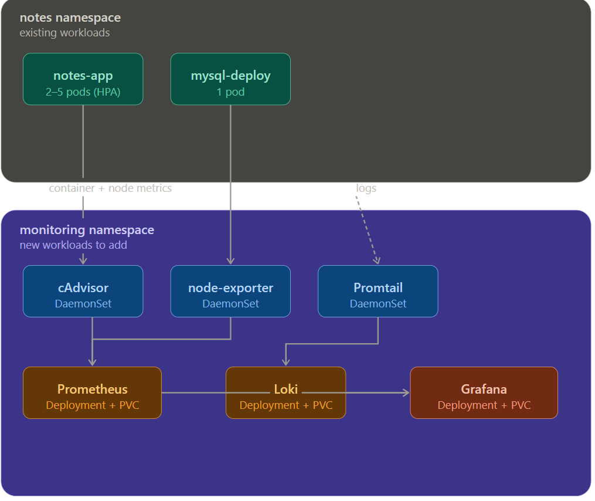

# 📝 Notes App — Kubernetes Deployment

A full-stack Notes application built with **Django REST Framework** + **React**, containerized with Docker, and deployed on Kubernetes with autoscaling, persistent storage, and monitoring support.

---

## 🏗️ Architecture Overview

```
                        ┌──────────────────────────────────┐
                        │         Kubernetes Cluster       │
                        │          (Namespace: notes)      │
                        │                                  │
  User ──► Service ───► │  notes-app pods (HPA: 1–5)       │
           (ClusterIP)  │       ▲  initContainer waits     │
                        │       │  for MySQL ready         │
                        │  mysql-service ──► mysql pod     │
                        │                      │           │
                        │               PersistentVolume   │
                        │               (3Gi hostPath)     │
                        └──────────────────────────────────┘
```

**Stack:**
- **Backend:** Django REST Framework (Python)
- **Frontend:** React (served as static build)
- **Database:** MySQL 8.0
- **Orchestration:** Kubernetes (tested with Kind)
- **Monitoring:** Prometheus + Grafana

---

## 📁 Project Structure

```
notes-app/
├── application/          # Django backend + React frontend source
│   ├── Dockerfile
│   ├── api/               # Django REST API (models, views, serializers)
│   ├── mynotes/           # React frontend
│   ├── notesapp/          # Django project settings
│   └── requirements.txt
├── k8s/                   # Kubernetes manifests
│   ├── namespace.yml
│   ├── configmap.yml
│   ├── secrets.yml
│   ├── pv.yml
│   ├── pvc.yml
│   ├── mysql-deployment.yml
│   ├── app-deployment.yml
│   ├── service.yml
│   ├── hpa.yml
│   ├── HPA-setup/         # HPA notes & guides
│   ├── dashboard/         # K8s dashboard setup
│   └── kind-cluster/      # Kind cluster config
├── grafana/               # Grafana provisioning
├── prometheus.yml         # Prometheus config
└── docker-compose.yml     # Local development
```

---

## ⚙️ Kubernetes Resources

| Resource | Kind | Details |
|---|---|---|
| `notes` | Namespace | Isolates all app resources |
| `my-configmap` | ConfigMap | MySQL host, port, database name |
| `my-secrets` | Secret | MySQL root password, user credentials |
| `mysql-pv` | PersistentVolume | 3Gi, hostPath `/mnt/data/mysql` |
| `mysql-pvc` | PersistentVolumeClaim | Requests 1Gi |
| `mysql-deploy` | Deployment | MySQL 8.0, Recreate strategy |
| `mysql-service` | Service | ClusterIP on port 3306 |
| `notes-app-deployment` | Deployment | App pods (2 replicas default) |
| `notes-app-service` | Service | ClusterIP on port 8000 |
| `notes-app-hpa` | HorizontalPodAutoscaler | 1–5 replicas, 50% CPU target |

---

## 🚀 Deployment Guide

### Prerequisites

- `kubectl` configured
- A running Kubernetes cluster (Kind, Minikube, or managed)
- Metrics Server installed (required for HPA)

### 1. Create Namespace

```bash
kubectl apply -f k8s/namespace.yml
```

### 2. Apply ConfigMap & Secrets

```bash
kubectl apply -f k8s/configmap.yml
kubectl apply -f k8s/secrets.yml
```

### 3. Set Up Persistent Storage

```bash
kubectl apply -f k8s/pv.yml
kubectl apply -f k8s/pvc.yml
```

### 4. Deploy MySQL

```bash
kubectl apply -f k8s/mysql-deployment.yml
# Wait for MySQL to be ready
kubectl wait --for=condition=ready pod -l app=mysql -n notes --timeout=120s
```

### 5. Deploy the App

```bash
kubectl apply -f k8s/app-deployment.yml
kubectl apply -f k8s/service.yml
```

### 6. Apply HPA

```bash
kubectl apply -f k8s/hpa.yml
```

### 7. Verify Everything

```bash
kubectl get all -n notes
kubectl get hpa -n notes
```

---

## 🔄 HPA (Horizontal Pod Autoscaler)

The app automatically scales between **1 and 5 replicas** based on CPU utilization.

| Setting | Value |
|---|---|
| Min Replicas | 1 |
| Max Replicas | 5 |
| CPU Target | 50% average utilization |
| Scale Up window | 30s (adds 1 pod per 30s) |
| Scale Down window | 300s (removes 1 pod per 60s) |

The conservative scale-down window prevents flapping under variable load.

---

## 🐳 Local Development (Docker Compose)

A `.env` file is used to configure the app locally. Create one at the project root:

```env
MYSQL_DATABASE=test_db
MYSQL_USER=root
MYSQL_PASSWORD=root
MYSQL_HOST=db
MYSQL_PORT=3306
```

> ⚠️ **Do not commit `.env` to version control.** Make sure it's listed in your `.gitignore`.

Then start the app:

```bash
docker-compose up --build
```

The app will be available at `http://localhost:8000`.

---

## 🔒 Secrets

Secrets are base64-encoded in `k8s/secrets.yml`. **Do not commit real credentials to version control.**

To encode your own values:
```bash
echo -n "your_password" | base64
```

To decode:
```bash
echo "VGVzdEAxMjM=" | base64 --decode
```

---

## 📊 Monitoring

The project includes Prometheus and Grafana configuration for observability.

```bash
# Prometheus config
prometheus.yml

# Grafana provisioning
grafana/provisioning/dashboards/
grafana/provisioning/datasources/
```

---

## 🏷️ App Container Details

- **Image:** `saumitrarajput/notes-app:v1`
- **Port:** `8000`
- **Init container:** Waits for MySQL on port 3306 before starting (`busybox` with `nc -z`)
- **Resource requests:** 100m CPU / 128Mi memory
- **Resource limits:** 200m CPU / 256Mi memory
- **Probes:**
  - Readiness: HTTP GET `/` on port 8000
  - Liveness: HTTP GET `/` on port 8000 (60s initial delay)

---

## 📄 License

See [LICENSE](LICENSE) for details.
